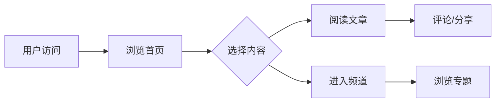

## 1. Product Overview
中国历史网是一个专注于中国历史文化传播的综合性门户网站，仿照人民网、读书网等权威媒体的布局风格，提供最新、最权威的历史资讯和深度内容。
- 主要目的：传播中华优秀传统文化，提供权威历史资料
- 目标用户：历史爱好者、学生、研究者、文化爱好者
- 市场价值：填补权威历史资讯聚合平台的空白

## 2. Core Features

### 2.1 User Roles
| Role | Registration Method | Core Permissions |
|------|---------------------|------------------|
| Guest User | None | Browse content |
| Registered User | Email/Phone | Bookmark, comment, share |

### 2.2 Feature Module
1. **首页**: 轮播大图、头条新闻、历史资讯、专题推荐
2. **历史频道**: 朝代分类、历史人物、事件专题
3. **文化频道**: 传统文化、艺术鉴赏、文物古迹
4. **学术研究**: 学术论文、研究动态、专家观点
5. **互动社区**: 用户评论、历史问答、话题讨论

### 2.3 Page Details
| Page Name | Module Name | Feature description |
|-----------|-------------|---------------------|
| 首页 | Hero轮播 | 自动轮播重要历史事件、专题报道 |
| 首页 | 头条新闻 | 展示最新权威历史资讯，自动更新 |
| 首页 | 历史频道入口 | 按朝代分类的历史内容入口 |
| 历史频道 | 朝代导航 | 从上古到近现代的历史朝代导航 |
| 历史频道 | 人物传记 | 历史名人详细介绍 |
| 文化频道 | 文化遗产 | 世界文化遗产展示 |
| 学术研究 | 论文列表 | 最新学术论文摘要 |
| 互动社区 | 评论系统 | 用户评论和互动功能 |

## 3. Core Process
用户访问首页 → 浏览头条新闻 → 点击感兴趣的文章 → 阅读详情 → 评论/分享

## 4. User Interface Design
### 4.1 Design Style
- 主色调：中国红 (#C8102E)，搭配金色 (#D4AF37)
- 辅助色：深蓝色 (#1A365D) 用于文字和背景
- 按钮风格：圆角矩形，红色主按钮，悬停有渐变效果
- 字体：思源黑体，标题加粗，正文清晰可读
- 布局风格：卡片式布局，顶部导航，响应式设计
- 图标风格：简洁现代，中国风元素点缀

### 4.2 Page Design Overview
| Page Name | Module Name | UI Elements |
|-----------|-------------|-------------|
| 首页 | Header | Logo、导航菜单、搜索框、用户入口 |
| 首页 | Hero轮播 | 大图轮播、标题、摘要、自动切换 |
| 首页 | 新闻列表 | 卡片布局、缩略图、标题、来源、时间 |
| 首页 | 频道入口 | 图标+文字、网格布局 |
| 文章详情 | 内容区 | 标题、作者、发布时间、正文、图片 |
| 文章详情 | 互动区 | 点赞、评论、分享按钮 |

### 4.3 Responsiveness
- Desktop-first设计，支持响应式布局
- 移动端自适应：导航折叠为汉堡菜单，卡片单列显示
- 触控优化：按钮尺寸适合触摸操作

### 4.4 3D Scene Guidance
- 可选3D文物展示模块（如兵马俑、青铜器）
- 使用Three.js实现360度旋转展示
- 配合文物详细介绍
