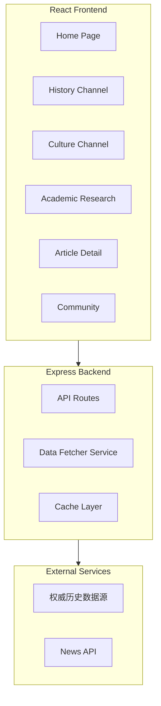
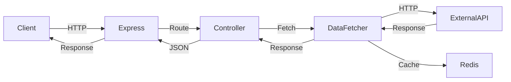

## 1. Architecture Design


## 2. Technology Description
- Frontend: React@18 + TypeScript + TailwindCSS@3 + Vite
- Initialization Tool: vite-init
- Backend: Express@4 + TypeScript
- Data Source: 聚合权威历史网站RSS/API
- State Management: Zustand
- Icons: lucide-react
- Build Tool: Vite

## 3. Route Definitions
| Route | Purpose | Component |
|-------|---------|-----------|
| / | 首页 | HomePage |
| /history | 历史频道 | HistoryChannel |
| /history/dynasty/:name | 朝代详情 | DynastyDetail |
| /history/person/:id | 人物传记 | PersonDetail |
| /culture | 文化频道 | CultureChannel |
| /academic | 学术研究 | AcademicPage |
| /article/:id | 文章详情 | ArticleDetail |
| /community | 互动社区 | CommunityPage |

## 4. API Definitions

### 4.1 Frontend API Calls

#### 获取首页数据
```typescript
// GET /api/home
interface HomeResponse {
  banners: Banner[];
  headlines: Article[];
  latestNews: Article[];
  featuredTopics: Topic[];
}

interface Banner {
  id: string;
  title: string;
  image: string;
  link: string;
}

interface Article {
  id: string;
  title: string;
  summary: string;
  image: string;
  source: string;
  publishTime: string;
  category: string;
}

interface Topic {
  id: string;
  name: string;
  description: string;
  coverImage: string;
}
```

#### 获取历史频道数据
```typescript
// GET /api/history/dynasties
interface Dynasty {
  id: string;
  name: string;
  startYear: number;
  endYear: number;
  description: string;
  featuredEmperors: string[];
  keyEvents: string[];
}

// GET /api/history/persons
interface Person {
  id: string;
  name: string;
  dynasty: string;
  role: string;
  avatar: string;
  achievements: string[];
  biography: string;
}
```

#### 获取文化频道数据
```typescript
// GET /api/culture/heritages
interface Heritage {
  id: string;
  name: string;
  type: string;
  location: string;
  description: string;
  images: string[];
}
```

#### 获取学术研究数据
```typescript
// GET /api/academic/papers
interface Paper {
  id: string;
  title: string;
  author: string;
  journal: string;
  publishDate: string;
  abstract: string;
  keywords: string[];
}
```

## 5. Server Architecture Diagram


## 6. Data Model

### 6.1 Data Model Definition

```mermaid
erDiagram
    ARTICLE {
        string id PK
        string title
        string content
        string summary
        string source
        datetime publish_time
        string category
        string image_url
        string author
    }
    
    DYNASTY {
        string id PK
        string name
        int start_year
        int end_year
        string description
        string flag_image
    }
    
    PERSON {
        string id PK
        string name
        string dynasty_id FK
        string role
        string avatar_url
        text biography
    }
    
    HERITAGE {
        string id PK
        string name
        string type
        string location
        text description
        string images
    }
    
    COMMENT {
        string id PK
        string article_id FK
        string user_id
        text content
        datetime created_at
    }
    
    DYNASTY ||--o{ PERSON : "has"
    ARTICLE ||--o{ COMMENT : "has"
```


### 6.2 Data Source Configuration
- 权威数据源：人民网历史频道、新华网历史栏目、中国国家博物馆官网
- 更新频率：每小时自动抓取更新
- 数据缓存：Redis缓存，有效期1小时

## 7. Project Structure
```
/
├── src/
│   ├── components/
│   │   ├── Header.tsx
│   │   ├── Footer.tsx
│   │   ├── BannerCarousel.tsx
│   │   ├── ArticleCard.tsx
│   │   ├── DynastyCard.tsx
│   │   └── CommentSection.tsx
│   ├── pages/
│   │   ├── HomePage.tsx
│   │   ├── HistoryChannel.tsx
│   │   ├── CultureChannel.tsx
│   │   ├── AcademicPage.tsx
│   │   ├── ArticleDetail.tsx
│   │   └── CommunityPage.tsx
│   ├── hooks/
│   │   └── useDataFetcher.ts
│   ├── store/
│   │   └── appStore.ts
│   ├── utils/
│   │   ├── api.ts
│   │   └── helpers.ts
│   ├── types/
│   │   └── index.ts
│   ├── App.tsx
│   ├── main.tsx
│   └── index.css
├── api/
│   ├── src/
│   │   ├── routes/
│   │   ├── services/
│   │   ├── utils/
│   │   └── server.ts
│   └── package.json
├── public/
├── index.html
├── package.json
├── vite.config.ts
├── tailwind.config.js
└── tsconfig.json
```
